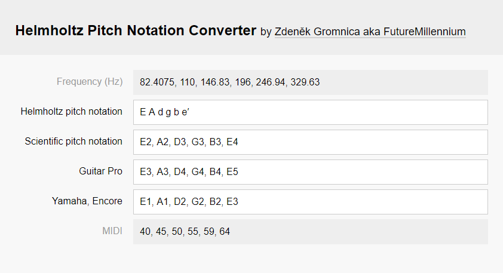

# [Helmholtz Pitch Notation Converter](https://futuremillennium.github.io/Helmholtz-Pitch-Notation-Converter/)
A web app for converting between Helmholtz and scientific pitch notation instantly. [Open the web app →](https://futuremillennium.github.io/Helmholtz-Pitch-Notation-Converter/)

<ul>
	<li>Convert between <strong><a href="https://en.wikipedia.org/wiki/Helmholtz_pitch_notation" target="_blank">Helmholtz pitch notation</a></strong> and <strong><a href="https://en.wikipedia.org/wiki/Scientific_pitch_notation" target="_blank">Scientific pitch notation</a></strong> and other formats instantly.</li>
	<li>Other formats include: 
		<ul>
			<li><strong>Frequency (Hz):</strong> the <a href="https://en.wikipedia.org/wiki/Pitch_(music)" target="_blank">pitch</a> or frequency of the note in Hz (Hertz). Assumes A4 = 440 Hz (also known as <a href="https://en.wikipedia.org/wiki/A440_(pitch_standard)" target="_blank">A440, A4, or the Stuttgart pitch</a>).</li>
			<li><strong>Guitar Pro:</strong> scientific pitch notation used in <a href="https://en.wikipedia.org/wiki/Guitar_Pro" target="_blank">Guitar Pro</a> that is noted an octave higher (i.e. sounds an octave lower).</li>
			<li><strong>Yamaha, Encore:</strong> scientific pitch notation used in some Japanese literature, Yamaha manuals and <a href="https://en.wikipedia.org/wiki/Encore_(software)" target="_blank">Encore</a>, that is noted an octave lower (i.e. sounds an octave higher).</li>
		</ul>
	</li>
</ul>

## Status: finished and functional

No updates planned at the moment.

## Found a mistake? Have any issues or feature requests?

Please add them in the <em>Issues</em> section.

## [Please consider supporting on Patreon!](https://www.patreon.com/FutureMillennium)

Made by [Zdeněk Gromnica aka FutureMillennium](http://futuremillennium.com/).